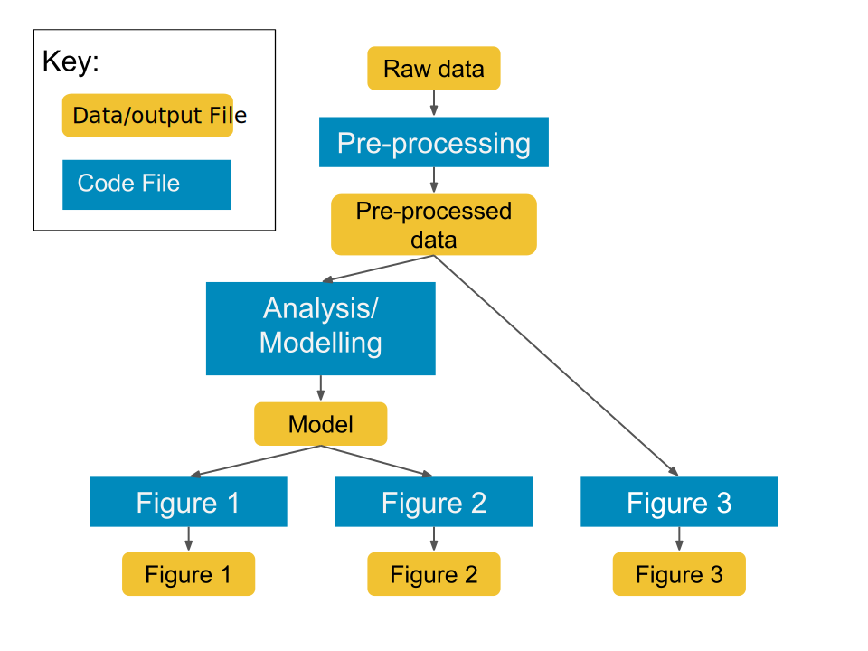

```{r setup, include=FALSE}
options(htmltools.dir.version = FALSE)
```

```{r xaringan-themer, include=FALSE, warning=FALSE}
library(xaringanthemer)
style_mono_accent(
  base_color = "#09274B",
  base_font_size = "32px", 
  header_h1_font_size = "2.0rem",
  header_h2_font_size = "1.5rem",
  header_h3_font_size = "1.25rem", 
  header_background_content_padding_top = "2rem", 
  header_font_google = google_font("Lato"),
  text_font_google   = google_font("Montserrat", "300", "300i", "500"),
  code_font_google   = google_font("Source Code Pro", "300", "500"), 
  extra_css = list("p" = list("margin-block-start" = "0.5em", 
                              "margin-block-end" = "0.5em"), 
                   "ul" = list("margin-block-start" = "0.5em", 
                              "margin-block-end" = "0.5em"), 
                   "li" = list("margin-block-start" = "0.5em", 
                              "margin-block-end" = "0.5em"), 
                   "pre" = list("margin-top" = "0.5em", 
                              "margin-bottom" = "0.5em"), 
                   ".small" = list("font-size" = "80%"), 
                   ".tiny" = list("font-size" = "50%")), 
  link_color = "#339944"
)
```
class: inverse, center, middle

# `r desc::desc_get('Title', '..')`
### `r rmarkdown::metadata$author`
### `r rmarkdown::metadata$institute`
### (updated: `r Sys.Date()`)

---
class: inverse, center, middle

## "Any fool can write code that a computer can understand. <br />Good programmers write code that humans can understand."

<p style="text-align:right">from "Refactoring: Improving the Design of Existing Code" by Martin Fowler</p>

---
# Motivations

* In addition to code that works, ideally it is **also**:
  - easy to read and understand
  - easy to maintain or change
  - obvious in its correctness
  - aesthetically pleasing?

---
# Learning Outcomes

By the end of the workshop, participants will be able to:

* implement functions to make code more modular and increase reproducibility
* use data structures to manage inputs and outputs
* recognize and fix basic code smells

---
# Disclaimer

* Concepts are intended to be universal, but code examples will be in **`R`**.
* Like any other skill, *effective* practice matters!
  - working code != easy-to-read code (e.g. answers from Stack Overflow)
  - when reading, ask yourself "is it clear what is going on?" (even if you don't know the detailed mechanisms)

---
class: inverse, center, middle

# Breaking Code into Functions

---
# What are functions?

* **Functions** let you refer to another piece of code by (a hopefully informative!) name

```{r, eval = FALSE}
  mean()
  # computes arithmetic mean of input
```

* You can write your own functions, too!
```{r, eval = FALSE}
  celsius_to_fahrenheit <- function(x) {
    9/5 * x + 32
  }
```

---
# Why write your own functions?

* It seems like extra work...

--
* BUT, it enables:
  - repeating the same operation on different inputs (e.g. datasets, variables, parameter values, etc.)
  - clarifying the larger organizational structure of the code

---
# Duplication

```{r, eval = FALSE}
df <- data.frame( a = rnorm(10),
                  b = rnorm(10),
                  c = rnorm(10))

# rescale all the columns of df
df$a <- (df$a - min(df$a)) / 
  (max(df$a) - min(df$a))
df$b <- (df$b - min(df$b)) / 
  (max(df$b) - min(df$a))
df$c <- (df$c - min(df$c)) / 
  (max(df$c) - min(df$c))
```

---
# Define a function!

```{r, eval = FALSE}
rescale01 <- function(x) {
  (x - min(x)) / (max(x) - min(x))
}

# rescale all the columns of df
df$a <- rescale01(df$a)
df$b <- rescale01(df$b)
df$c <- rescale01(df$c)

# or with dplyr
df <- df %>% mutate_at(c("a", "b", "c"), 
                       rescale01)
```

---
# Notes

* calculation defined once and re-used
* changes or corrections only need to happen in one place
* fewer chances for error when modifying after copy-paste

---
# Workflow structure

```{r, echo = FALSE, out.width = "60%", fig.alt = 'Diagram of the workflow in a hypothetical data analysis project with boxes representing code and data/output files. "Raw data" goes into "Pre-processing" and then "Pre-processed data". "Pre-processed data" goes directly into "Figure 3" (code) and then "Figure 3" (Data file), but also into "Analysis/Modelling". The "Model" output from "Analysis/Modelling" is used in code for "Figure 1" and "Figure 2", which generate files "Figure 1" and "Figure 2".'}

```

.tiny[modified from "Reproducible research best practices @JupyterCon" (version 18) by Rachael Tatman, https://www.kaggle.com/rtatman/reproducible-research-best-practices-jupytercon]

---
# Example Code

```{r, eval = FALSE}
data_raw <- readRDS("readings.dat")
data_proc <- preprocess_data(data_raw)

fitted_model <- run_model(data_proc)

plot_model_forecasts(fitted_model,
    "figure-1_abundance-forecasts.pdf")
plot_abundance_residuals(fitted_model,
    "figure-2_abundance-residuals.pdf")
plot_abundance_histogram(data_proc, 
    "figure-3_abundance-residuals.pdf")
```

---
# Notes

* The steps of the analysis are clear.
* When making changes/additions:
  - you know which function to change
  - adding a new analysis: write a new function, include it in the workflow script
* Ideally save `data_proc` and `fitted_model` objects to a file. Then figure code can be changed without re-running the model.

---
# Tips for writing functions

* name things well
* plan for flexibility
* split large tasks into smaller units

---
# Tip 1: Naming Things

* function names should be verbs

```{r, eval = FALSE}
# bad
row_adder()
permutation()

# good
add_row()
permute()
```

.small[examples from https://style.tidyverse.org/functions.html#naming]
---
# Tip 2: Plan for flexibility

```{r, eval = FALSE}
plot_abundance_histogram <- 
  function(data_proc, filename, 
           width = 6, height = 6) { 
    # {{code}} 
  }
```
* input data and location of output are easily changed
* width and height are adjustable, but have reasonable defaults

---
# Tip 3: Function size

* Each function should have a single well-defined task
  - this makes testing and debugging easier
* Functions should ideally be 50 lines or less
  - not a hard rule, divide work into functions sensibly!

---
# Tip 3 (cont'd)

* If a line or set of lines of code is complicated, it might need to be its own function (with a good name)

```{r, eval = FALSE}
# bad
if (class(x)[[1]]) == "numeric" || 
    class(x)[[1]] == "integer")

# good
if (is.numeric(x))
```
.small[examples from https://speakerdeck.com/jennybc/code-smells-and-feels?slide=36]
---
class: inverse, center, middle

# Code Smells

---
# What are "code smells"

* aspects of the code that make it appear less ideal
* the code is not necessarily buggy  
--
  - but it is hard to tell!

---
# Example (code smell)

```{r, eval = FALSE}


```

---
# Solution

* follow a coding style guide
* use technological tools like automatic indentation and linters
* understand patterns and how to fix them
  - **refactoring**: rewriting code without changing its behavior (i.e. make it faster, cleaner, easier to use)

---

* indentation
* spaces


---
# Comments


---
# Thanks

* Let me know what content you'd like to see
* Contact me for additional questions or consultation requests!
* Check back in on the libguide for more modules and contact info:
  - https://guides.uflib.ufl.edu/reproducibility
