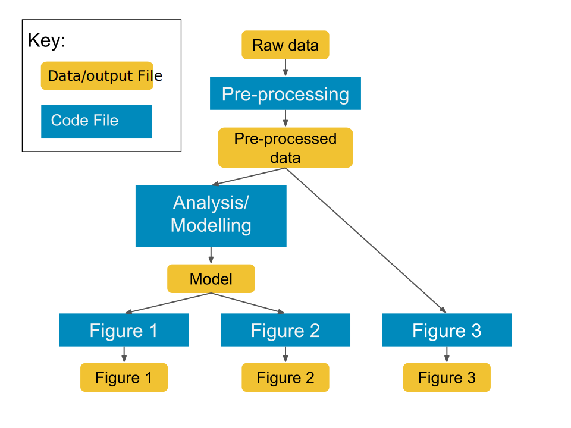

```{r setup, include=FALSE}
options(htmltools.dir.version = FALSE)
```

```{r xaringan-themer, include=FALSE, warning=FALSE}
library(xaringanthemer)
style_mono_accent(
  base_color = "#09274B",
  base_font_size = "32px", 
  header_h1_font_size = "2.0rem",
  header_h2_font_size = "1.5rem",
  header_h3_font_size = "1.25rem", 
  header_background_content_padding_top = "2rem", 
  header_font_google = google_font("Lato"),
  text_font_google   = google_font("Montserrat", "300", "300i", "500"),
  code_font_google   = google_font("Source Code Pro", "300", "500"), 
  extra_css = list("p" = list("margin-block-start" = "0.5em", 
                              "margin-block-end" = "0.5em"), 
                   "ul" = list("margin-block-start" = "0.5em", 
                              "margin-block-end" = "0.5em"), 
                   "li" = list("margin-block-start" = "0.5em", 
                              "margin-block-end" = "0.5em"), 
                   "pre" = list("margin-top" = "0.5em", 
                              "margin-bottom" = "0.5em"), 
                   ".small" = list("font-size" = "80%"), 
                   ".tiny" = list("font-size" = "50%"), 
                   "remark-code" = list("word-wrap" = "break-word")), 
  link_color = "#339944"
)
```
class: inverse, center, middle

# `r desc::desc_get('Title', '..')`
### `r rmarkdown::metadata$author`
### `r rmarkdown::metadata$institute`
### (updated: `r Sys.Date()`)

---
class: inverse, center, middle

## "Any fool can write code that a computer can understand. <br />Good programmers write code that humans can understand."

<p style="text-align:right">from "Refactoring: Improving the Design of Existing Code" by Martin Fowler</p>

---
# Motivations

* In addition to code that **works correctly**, it should also be:
  - easy to read and understand
  - easy to maintain or change
  - easy to verify its correct operation
  - aesthetically pleasing (maybe?)

---
# Learning Outcomes

By the end of the workshop, participants will be able to:

`r gsub("\n ", "\n", desc::desc_get("learningOutcomes"))`

---
# A Note

* These concepts are universal, but code examples are in **`R`**.
* Like any other skill, **_effective_** practice matters!
  - Making code easy to read and maintain usually means extra work *after* the code is correctly working
  - Keep in mind that code is almost never finished! So make it easier for you to revise it later.

---
class: inverse, center, middle

# Breaking Code into Functions

---
# What are functions?

* **Functions** let you refer to another piece of code by (a hopefully informative!) name

```{r, eval = FALSE}
  mean()
  # computes arithmetic mean of input
```

* You can write your own functions, too!
```{r, eval = FALSE}
  celsius_to_fahrenheit <- function(x) {
    9/5 * x + 32
  }
```

---
# Why write your own functions?

* If my script already works, this seems like extra work...

--
* Functions enable you to:
  - perform the same task on different inputs (e.g. new data, parameter values, etc.)
  - organize your code to communicate its operation

---
# You can repeat code ...
```{r, results='hide'}
df <- data.frame( a = rnorm(10),
                  b = rnorm(10),
                  c = rnorm(10))

# rescale all the columns of df
df$a <- (df$a - min(df$a)) / 
  (max(df$a) - min(df$a))
df$b <- (df$b - min(df$b)) / 
  (max(df$b) - min(df$a))
df$c <- (df$c - min(df$c)) / 
  (max(df$c) - min(df$c))
```

---
# Or define a function!

```{r, echo = FALSE}
library(dplyr)
```

```{r, results='hide'}
rescale_to_01 <- function(x) {
  (x - min(x)) / (max(x) - min(x))
}

# rescale the columns of df
df$a <- rescale_to_01(df$a)
df$b <- rescale_to_01(df$b)
df$c <- rescale_to_01(df$c)

# or with dplyr
df <- df %>% mutate(
    across(c("a", "b", "c"), rescale_to_01))
```

---
# **DRY** = "Don't Repeat Yourself"

* If we need to change the calculation, that change is only in the function.
* It is easier to find where to change the code, because of the function name.
* Eith an effective name, someone can understand what the code does without needing to understand the implementation.

--
  *I don't need to know how an engine works to drive a car.*

---
# Workflow structure

```{r, echo = FALSE, out.width = "60%", fig.alt = 'Diagram of the workflow in a hypothetical data analysis project with boxes representing code and data/output files. "Raw data" goes into "Pre-processing" and then "Pre-processed data". "Pre-processed data" goes directly into "Figure 3" (code) and then "Figure 3" (Data file), but also into "Analysis/Modelling". The "Model" output from "Analysis/Modelling" is used in code for "Figure 1" and "Figure 2", which generate files "Figure 1" and "Figure 2".'}

```

.tiny[modified from "Reproducible research best practices @JupyterCon" (version 18) by Rachael Tatman, https://www.kaggle.com/rtatman/reproducible-research-best-practices-jupytercon]

---
# Example Code

.tiny[
<pre>
library(tidyverse)

source("analysis_functions.R")
source("plotting_functions.R")

data_raw <- readRDS("readings.dat")
data_proc <- preprocess_data(data_raw)

fitted_model <- run_model(data_proc)

plot_model_forecasts(fitted_model,
    "figure-1_abundance-forecasts.pdf")
plot_abundance_residuals(fitted_model,
    "figure-2_abundance-residuals.pdf")
plot_abundance_histogram(data_proc, 
    "figure-3_abundance-residuals.pdf")
</pre>
]

---
# Notes

* The code matches the steps of the analysis.
* It is easy to make changes in the right place:
  - to modify a plot - edit the function
  - including a new figure - write a new function and add it to the workflow script
* Possible improvement: 
  - save the processed data and model output to a file, so that they do not need to be re-run
  
---
# Tips for writing functions

* name things well
* plan for (some) flexibility
* split large, complex tasks into smaller units, each with a clear purpose
* use data structures to store complex objects, as needed

---
# Tip 1: Naming Things

Function names should be verbs

```{r, eval = FALSE}
# bad
row_adder()
permutation()

# good
add_row()
permute()
```

.small[examples from https://style.tidyverse.org/functions.html#naming]
---
# Tip 2: Plan for flexibility

```{r, eval = FALSE}
plot_abundance_histogram <- 
  function(data_proc, filename, 
           width = 6, height = 6) { 
    # {{code}} 
  }
```
* (data) and (file output) are required inputs
* width and height are adjustable, but have defaults that are ok

---
# Tip 3: Subdividing work

1. start with the main goal of your program
2. split the goal into separate subgoals
  - e.g. read in data, clean data, fit model, do statistics, make plots
3. repeat until each subgoal is a single task
  - write a function for each task
  - you may need to choose implementation details to get things working initially

---
# Notes on Tip 3

* Get something simple working first!
* You can always make changes to the details and/or add flexibility later.
* Each function should have a single well-defined task
* Functions should ideally be 50 lines or less
  - this is a **guideline**—divide work into functions sensibly!

---
# More Notes on Tip 3

* If a line or set of lines of code is complicated, a new function might be needed (with a good name)

```{r, eval = FALSE}
# bad
if (class(x)[[1]]) == "numeric" || 
    class(x)[[1]] == "integer")

# good
if (is.numeric(x))
```
.small[examples from https://speakerdeck.com/jennybc/code-smells-and-feels?slide=36]

---
# Tip 4: Use data structures

Most programming languages let you create data structures to store complex data.
* e.g. in **`R`**, you can define a list to include data, settings, and results. This list can be returned from a function:

```{r, eval = FALSE}
list(data = mtcars, 
     var_1 = "mpg", 
     var_2 = "cyl", 
     rho = cor(mtcars$mpg, mtcars$cyl))
```

---
class: inverse, center, middle

# Comments

---

<blockquote class="twitter-tweet"><p lang="en" dir="ltr">Developers commenting their code <a href="https://t.co/jKURCVR9ds">pic.twitter.com/jKURCVR9ds</a></p>&mdash; Ricardo Ferreira (@riferrei) <a href="https://twitter.com/riferrei/status/1358180071081713670?ref_src=twsrc%5Etfw">February 6, 2021</a></blockquote>

---
# Comment Dos & Don'ts

* **Do** use comments to describe **why**, not **how**
* **Do** document the inputs, outputs, and purpose of each function
* **Do** store notes/references in comments
* **Don't** turn code off and on with comments

---
# Comment Dos & Don'ts

**Do** use comments to describe **why**, not **how**

Bad:
```{r, eval = FALSE}
# Set lib as (1, [2/3 * n])
lib <- c(1, floor(2/3 * n))
```

Good:
```{r, eval = FALSE}
# set aside 2/3 of data to train model
lib <- c(1, floor(2/3 * n))
```

---
# Comment Dos & Don'ts

**Do** document the inputs, outputs, and purpose of each function

```{r, eval = FALSE}
plot_abundance_histogram <- 
  function(data_proc, filename, 
           width = 6, height = 6) { 
    # {{code}} 
  }
```
* What kind of object is `data_proc`, what fields/columns have the abundance data?

---
# Comment Dos & Don'ts

**Do** store notes/references in comments

```{r, eval = FALSE}
# cholesky algorithm from Rasmussen & 
#   Williams (2006, algorithm 2.1)
R <- chol(Sigma)
alpha <- backsolve(R, forwardsolve(t(R), y_lib - mean_y))
L_inv <- forwardsolve(t(R), diag(NROW(x_lib)))
Sigma_inv <-  t(L_inv) %*% L_inv
```

---
# Comment Dos & Don'ts

**Don't** turn code off and on with comments
```{r, eval = FALSE}
# cat("The value of x is", x)
```

--

- use conditional logic instead  
```{r, eval = FALSE}
if (DEBUG_MODE) {
  cat("The value of x is", x)
}
```

---
class: inverse, center, middle

# Code Smells

---
# What are "code smells"?

* properties of code that seem not so ideal
  - not always incorrect, but *not quite right*
* recognize "code smells" is a skill, depends on experience, and is also personal
* use a good style guide and avoid common issues!

---
# Some common code smells

* functions that are too long
* lots of single-letter variable names
* too much indentation
* no indentation
* duplicated (or near-identical) code fragments
* magic numbers

---
# TMI = too much indentation

.tiny[
<pre>
get_some_data <- function(config, outfile) {
  if (config_ok(config)) {
    if (can_write(outfile)) {
      if (can_open_network_connection(config)) {
        data <- parse_something_from_network()
        if(makes_sense(data)) {
          data <- beautify(data)
          write_it(data, outfile)
          return(TRUE)
        } else {
          return(FALSE)
        }
      } else {
        stop("Can't access network")
      }
    } else {
      \# uhm. What was this else for again?
    }
  } else {
    \# maybe, some bad news about ... the config? 
  }
}
</pre>
]
.small[example from https://speakerdeck.com/jennybc/code-smells-and-feels?slide=42]

---
# Simplify the logic!

.tiny[
<pre>
get_some_data <- function(config, outfile) {
  if (config_bad(config)) {
    stop("Bad config")
  }
  if (!can_write(outfile)) {
    stop("Can't write outfile")
  }
  if (!can_open_network_connection(config)) {
    stop("Can't access network")
  }
  <br />
  data <- parse_something_from_network()
  if(!makes_sense(data)) {
    return(FALSE)
  }
  data <- beautify(data)
  write_it(data, outfile)
  TRUE
}
</pre>
]
.small[example from https://speakerdeck.com/jennybc/code-smells-and-feels?slide=43]

---
# Magic Numbers

**Magic numbers** are values in the code where the meaning of the number is derived from context.

* confusing - what do they represent?
* brittle - the value isn't always fixed
* can usually be replaced with named constants

---
# Example

```{r, comment = ""}
cat("The correlation between mpg and cyl is", 
    cor(mtcars[,1], mtcars[,2]))
```
--
* What if we insert a column or change the order of columns?
* What if we want to change the variables?
  - is the text label still correct?

---
# Example (fixed)

* define variables for the "magic numbers"

```{r, comment = ""}
var_1 <- "mpg"
var_2 <- "cyl"
cat("The correlation between", var_1, 
    "and", var_2, "is", 
    cor(mtcars[,var_1], mtcars[,var_2]))
```

---
# Example (as a function)

* We can even turn it into a function!

```{r, comment = ""}
f <- function(df = mtcars, var_1 = "mpg", 
              var_2 = "cyl") {
  cat("The correlation between", var_1, 
      "and", var_2, "is", 
    cor(df[,var_1], df[,var_2]))
}

f()
```
---
# General Strategies

* Embrace **refactoring**: rewriting code without changing its behavior (i.e. make it faster, cleaner, easier to use)
* follow a coding **style guide**
  - links in the resources
* use technological tools like automatic indentation and linters
  - many modern IDEs (e.g. RStudio) have these built-in

---
# Thanks

* Let me know what content you'd like to see
* Contact me for additional questions or consultation requests!
* Check back in on the libguide for more modules and contact info:
  - https://guides.uflib.ufl.edu/reproducibility
